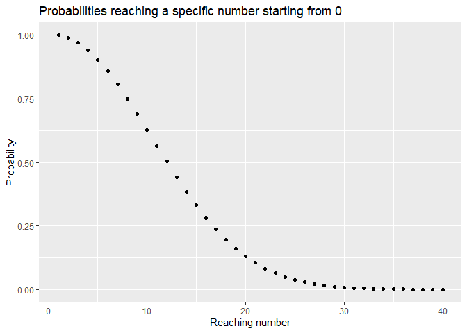

# The Button - A Probability Analysis
Matthias Möller

There is a little game on Steam: [The Button by
Elendow](https://store.steampowered.com/app/1999740/THE_BUTTON_by_Elendow/).

The advertisement promises the following:

> <div>
>
> > **Steam page description**
> >
> > Every time you press the button you get 1 point. Every time you
> > press the button your odds to lose all your points increases by 1%.
> > Good luck.
>
> </div>

Obviously, this is a lot information to process at once. You start with
some starting probability $p_w$ . You push a button, you either loose
with $p_l = 1-p_w$ or you continue. If you loose, you loose and should
feel bad that the probability was not on your side. Try to kiss the
probability next time before pressing this button.

If you don’t loose tho, you did everything right. You are 1 round
further, the sun shines on the brilliant head of yours because not
everyone was able reaching the point where you are. But don’t be in this
heightened state of happiness for too long, because you have ~~a
decision~~ to press the button again. There is no other way, you have to
go trough it again! But this time, “your odds to lose all your points
increases by 1%”. Oh god, no! What does it even mean? Is the new
$p_{ln+1} = p_{ln}+1$ where $p_{ln}$ is the loosing probability at round
$n$? Or is it more like $p_{ln+1} = p_{ln}*1.01$ ? As I am not a native
English speaker and the game master is not a native speaker, we can have
here some very serious misunderstandings.

Nobody likes misunderstandings, but as I said, there is no choice. We
can only press the button, again! and again! and again! until we,
inevitable, loose (or run away). Oh what a tragedy, such a cruel world.
This game is like the life itself, you press buttons until you loose, or
is it?  
  
As every normal human being, we should question everything. In
particular we should question this game! What if the advertisement text
lies to us? Wouldn’t be the first time. Maybe the whole game is a trap?
Maybe we don’t loose every time but the probability that we loose
decreases by 1%? Some people would be in an endless game of button
pressing when they reach 100%. Oh no, this would be cruel and if this is
the case, we have to warn everyone!

There is one guy, deedeedont, on [Steam
Community](https://steamcommunity.com/app/1999740/discussions/0/3843305689141436337/)
who thinks he solved the game already by mentioning, that the
probability is $p_{ln} = n$ . But how does he know? [Eyeballing
statistics](https://sites.google.com/a/crlstatistics.net/statrefs/statwiki-home/statwiki-main-2/fundamentals/common-errors-in-statistics/eyeballing-the-data)?
[Maybe from the bible like people could decipher from there when the
world ends?](https://en.wikipedia.org/wiki/2011_end_times_prediction)
What will be assumed next mit fancy math forumlas? Will he nilly-willy
predict the weather tomorrow in Saudi-Arabia? 50°C and sunny? Can we
trust him more or less than the developer?

It is obvious, that we cannot just answer all these question. There is
sadly only one way[^1] to answer them, we have to:

# Measure the Probability… or something

That’s right, we have to do it on our own. How can we measure
probabilities? Simple, just take samples. A lot. Do some math and claim
that this is true, that your sample size is big enough and that black
swans are heresy and everyone who proclaims otherwise will be handled…
for the emperor, blood for the blood god etc.

Anyway, let’s assume that the game always behaves equally on every run
(otherwise, we are doomed anyway, because of the heresy). Then we can do
$n$ runs and count, how often we lost on a specific number. The bigger
$n$ for the numbers is, the less error we have for our probabilities.

We can either collect the data by hand, but this sounds like boring
work. Nobody likes boring work and we all are not nobody (except
nobody).

# Collect the Data

We all love PCs, because they can do work, we don’t want to do.
Therefore, there is a little program in this repository which can do the
work for us.

This [program](./program) will simply capture every image on screen \#1, limit the
image so that only the button is visible. Do some OpenCV stuff to
extract the numbers (you need the red! button, no other color) and
recognize the extracted numbers. It reports the number in a csv file.
Afterwards, it auto clicks in the middle of the screen.

At the end, it prints statistics in another csv which summarizes, how
often a number was seen during the runs.

It is kinda an ugly duckling and currently just calibrated to my display
(3440x1440), you have to change the coordinates by yourself so that only
the button is in the ROI.

The image processing is kinda fast (~200microseconds on my machine), but
waiting for a new number after the mouse has been “auto”-clicked, takes
long. We have to wait around 300ms starting the click up until we see a
new number.

With this program, it is possible for us to have multiple runs.

I, for both of us, let it run for around 10k rounds. The raw data is
also in the repository under [*data*](./report/data).

# Total Reproducible Results

Just for your entertainment, lets have some look at the collected data.
First, of all, the data shows me that the game requires 77.7MB?! For a
button! You want a button? [Here, have a
button!](https://www.w3schools.com/tags/tryit.asp?filename=tryhtml_button_test)
You can style it, give it a golden color, make it bigger, smaller and
customize it’s reactions etc. in less than 77.7MB. You can even attach
my program towards it, it will be still less than 77.7MB.

For the runs, I saved the csv files, which are both combined are also
less than 77.7MB! he 77.7MB must contain secrets!

I got sidetracked, back to the data.

The [*out.csv*](./report/data/out.csv) file just contains every number the
program saw before each button press. The csv let your bleed your eyes,
as it has only 1 column. I am just slightly sorry for that format, just
don’t look at it as it is just there to have raw data and the second one
is more interesting.

The second, [*stats.csv*](./report/data/stats.csv), has the count of seen
number grouped by the number.

With this, we can very simple compute the probability for every step, by
simply dividing the amount of occurrences we counted on round n and
divide it with the amount of occurrences we counted for round n+1:
$p_{ln+1} = \frac{count(n)}{count(n+1)}$.

``` r
stats$p_n <- stats$counts / list(1000, stats$counts[1:nrow(stats)-1]) %>% simplify()
stats$expected_diff <- abs(stats$p_n - stats$expected)
colnames(stats) <- c("n", "counts", "expected p", "measured p", "expected - measured")
kable(head(stats, n=15))
```

|   n | counts | expected p | measured p | expected - measured |
|----:|-------:|-----------:|-----------:|--------------------:|
|   0 |   1000 |       1.00 |  1.0000000 |           0.0000000 |
|   1 |   1000 |       1.00 |  1.0000000 |           0.0000000 |
|   2 |    992 |       0.99 |  0.9920000 |           0.0020000 |
|   3 |    966 |       0.98 |  0.9737903 |           0.0062097 |
|   4 |    929 |       0.97 |  0.9616977 |           0.0083023 |
|   5 |    895 |       0.96 |  0.9634015 |           0.0034015 |
|   6 |    842 |       0.95 |  0.9407821 |           0.0092179 |
|   7 |    790 |       0.94 |  0.9382423 |           0.0017577 |
|   8 |    726 |       0.93 |  0.9189873 |           0.0110127 |
|   9 |    660 |       0.92 |  0.9090909 |           0.0109091 |
|  10 |    597 |       0.91 |  0.9045455 |           0.0054545 |
|  11 |    541 |       0.90 |  0.9061977 |           0.0061977 |
|  12 |    482 |       0.89 |  0.8909427 |           0.0009427 |
|  13 |    418 |       0.88 |  0.8672199 |           0.0127801 |
|  14 |    366 |       0.87 |  0.8755981 |           0.0055981 |

As we can see from the little table, the calculations confirm our
expectations where the sample size is big enough. The smaller the sample
size, the bigger is our observation error due to under sampling.

Or, if you are more someone who likes drawn images instead of boring
dusty tables.

``` r
runs <- 40
run_probas <- data.frame(run_to=seq(1,runs),prob_reaching=cumprod(seq(100, 100-(runs-1), -1)/100))
ggplot(run_probas, aes(x=run_to,y=prob_reaching)) + xlab("Reaching number") + ylab("Probability") + ggtitle("Probabilities reaching a specific number starting from 0") + geom_point()
```



This looks like a nice slope downwards! We can have fun riding it down,
but remind you, that it also shows the future. Every time you press the
button, your next future looks less likely to be a win. It might ruin
your fun, but maybe it is also something your are looking for.

# Conclusion

We can simply conclude that there is no surprise, nothing new,
everything is as expected. No secret, no UFO, nothing hidden. It is like
you pressed a button for a long time and in the end, you lost. That’s
it.

A bit disappointing, isn’t it? No not really! We were able to confirm
our believes and were able to transform believes into knowledge (with a
given probability that the black swan does not exist, like human-tall
rats don’t exist!).

All we can do is stop pressing the button and therefore stop loosing all
the time and use the slope as a nice water slope enjoying the summer.

But, can we?

Good night, Stanley.

[^1]: OK, there are maybe other ways like asking the developer, but this
    would not solve the advertisement trust issues or that we have to
    interact with a human stranger. Yikes.
